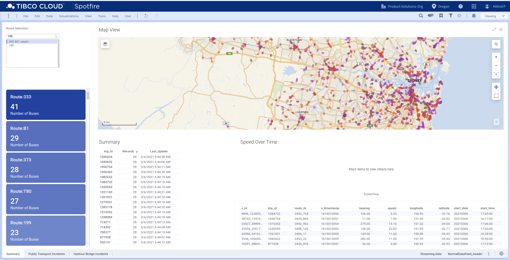
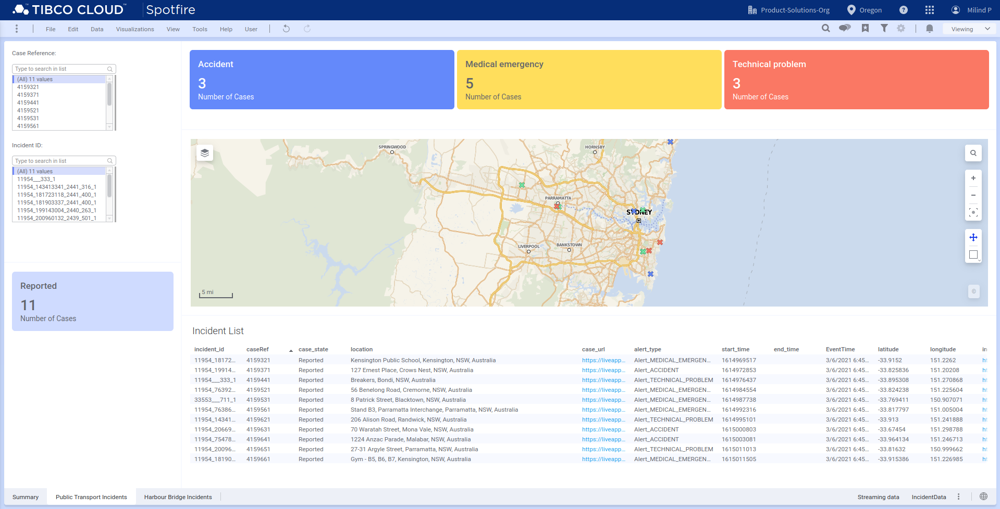
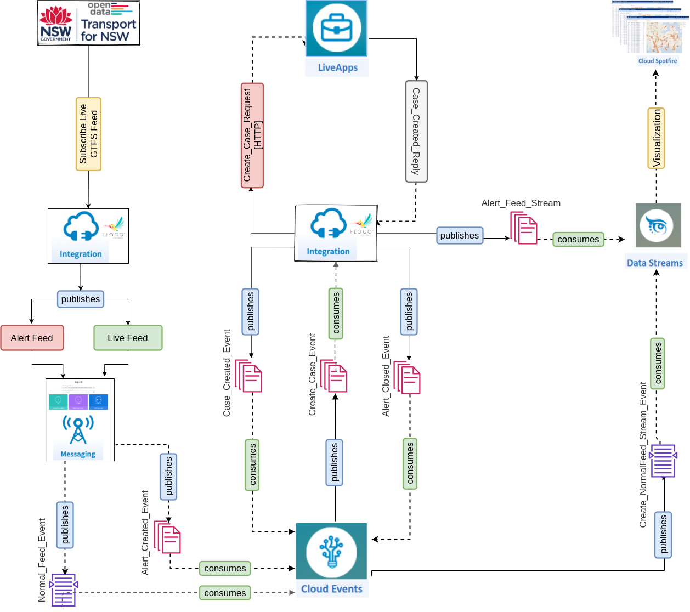

# Smart Transport Accelerator [Cloud Version]

From ​: TIBCO

Date ​: April 2021

Key links
Public Community Link: https://community.tibco.com/wiki/smart-transport-accelerator

Slack Channel: #accelerators-smart-transport-cloud

## Prerequisites (valid subscriptions)
- TIBCO Cloud™ Integration
- TIBCO Cloud™ Messaging
- TIBCO Cloud™ Events 
- TIBCO Cloud™ LiveApps 
- TIBCO Cloud™ DataStreams 
- TIBCO Cloud™ Spotfire

# Introduction

## Transport & Logistics Industry Trends

Among global industries, Transportation & Logistics stands to benefit the most from becoming data-driven. The agile use of organizational, public and private data is the fundamental success factor for recovering from the disruption of maintenance, operational failures, geopolitical instability  - even pandemics. 
As part of this, transportation providers must gain a comprehensive view of their assets and operations in order to increase the revenue and profit potential of their investments. In addition, they need to bring a customer-centric approach to ridership and commercial logistics. This includes more reliable scheduling, faster return to timetables after disruptions, and improved digital awareness and communications.

## Business Value
The TIBCO Real-Time Smart Transport Accelerator (Cloud Edition) is a 100% cloud-based solution that gives Transport & Logistics companies a fast start to solving two key business challenges:

1. Real time operational awareness of moving assets & incidents to help improve network and operational efficiency. It does this by consuming GTFS data in protobuf format and providing real time visualizations to identify and respond immediately to any operational incidents.

2. Event-driven actions when an incident, such as an accident or breakdown, occurs to help improve customer experience and quality of service. It does this by connecting to event feeds delivered through modern messaging formats - for example events detected through AI enabled smart cameras, as seen in the TIBCO Can Do That Sydney Harbour Bridge demo video. When an incident event occurs the accelerator then creates a case for the management of the incident. 

## Technology Overview

To begin, the Accelerator uses  TIBCO Cloud™ Integration to subscribe to a real-time position and trip update feeds delivered through GTFS-RT. In this case, we are using the real-time position data feed from the Open Data Hub provided by Transport for NSW (TfNSW). TfNSW is the government owned institution responsible for the public transport network in New South Wales, Australia, including buses, trains, light rail and  ferries. 

Originating from Google, the General Transit Feed Specification (GTFS) is a public data specification found at https://gtfs.org/. GTFS allows public and private transportation companies like TfNSW to publish their transit data in a standard format, to be consumed by a variety of software applications. Thousands of transportation providers around the world use this specification on a daily basis. The GTFS specification is composed of static data feeds that are generally updated on a daily basis, and GTFS RT which are real-time feeds that are updated every few seconds. This gives a true real-time view of operations inside the transport provider’s network.

The TfNSW GTFS feed is provided in Protobuf format, so the Accelerator uses  TIBCO Cloud™ Integration to transform this into JSON format. The JSON data is then processed by TIBCO Cloud™ Events to execute a set of defined business rules and correlate the events in real time. TIBCO Cloud™ LiveApps automates the creation of incidents for notifications about any accidents or medical emergencies incidents. TIBCO Cloud™ Spotfire generates the real time visualizations of all these correlated events, seen below.

# Solution Design

This accelerator demonstrates end-to-end real-time data integration with open source custom extensions, messaging, cloud events, streaming and visual analytics features using TIBCO's Connect and Predict capabilities using real time GTFS feeds provided by TfNSW’s Open Data Hub data services.

## Architecture Overview

Incorporating the modern application architecture as described by Responsive Application Mesh (RAM), a number of key Connect apabilities will be used in this accelerator.

As illustrated in the Architecture Diagram (above), this Accelerator:
- Uses the Develop capability, powered by Flogo, of TIBCO Cloud™ Integration (TCI Flogo) to extract, transform real time GTFS positions and trip updates feeds from Transport for NSW's Open Data Hub data services 
- It then publishes the streaming data in JSON format to TIBCO Cloud™ Messaging eFTL service (TCM eFTL). 
- TIBCO Cloud™ Events subscribes to an incoming stream of messages and runs it through a series of prescribed business rules. 
- Based on these business rules, some incidents will cause TCI Flogo to create a new case within TIBCO Cloud™ Live Apps. TCI Flogo will also generate new incident messages and publish these back to TIBCO Cloud™ Messaging. 
- TIBCO Cloud™ Data Streams is used as a durable subscriber to the incidents_data and general_feed messages within TCM eFTL service.  TIBCO Cloud™ Data Streams then provides the live streaming data directly to TIBCO Cloud™ Spotfire which displays the visual analytics.

The internal interaction diagram below, shows these steps in more detail.

## Internal Interaction Diagram

## Steps to setup the Smart Transport Accelerator
****[Let's Get Started](./docs/readme.md)****
